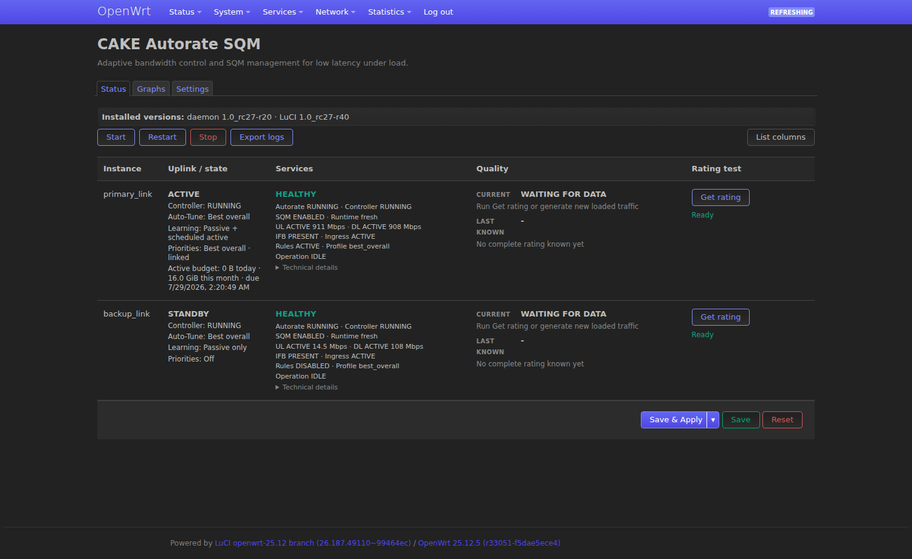
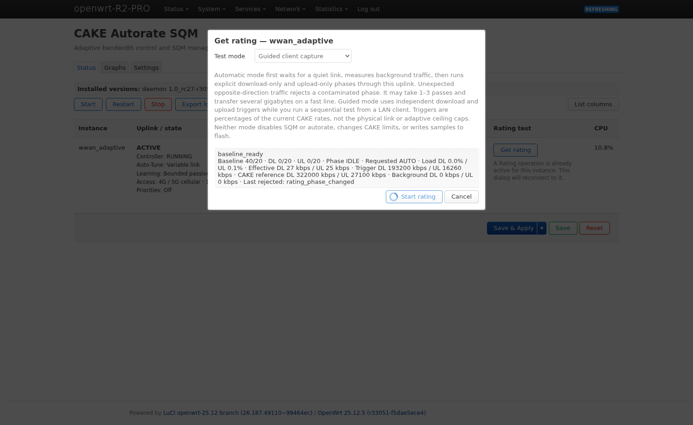
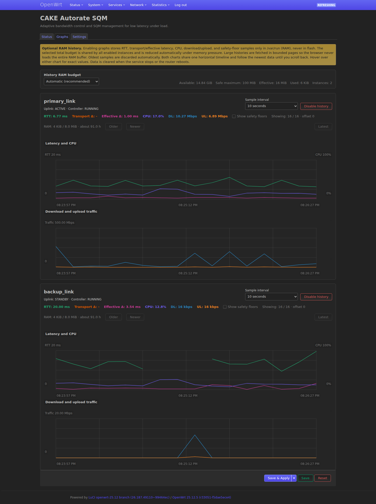
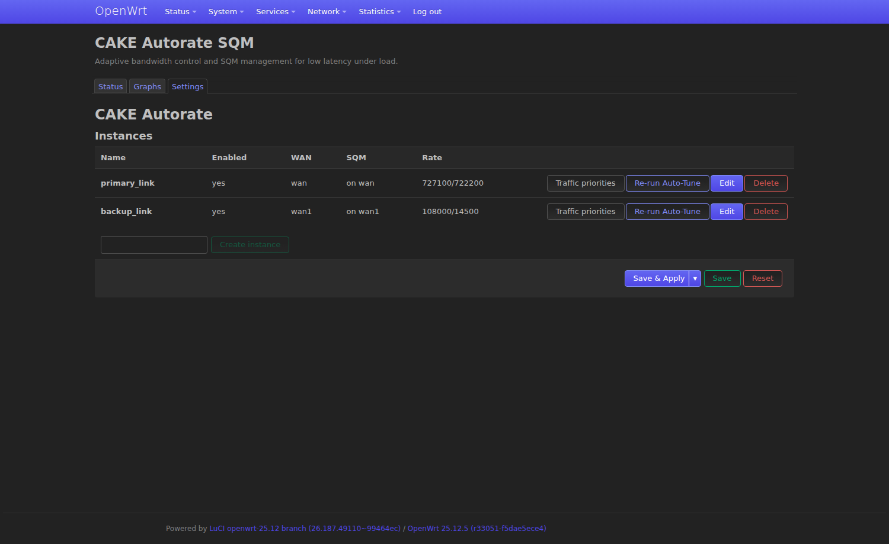
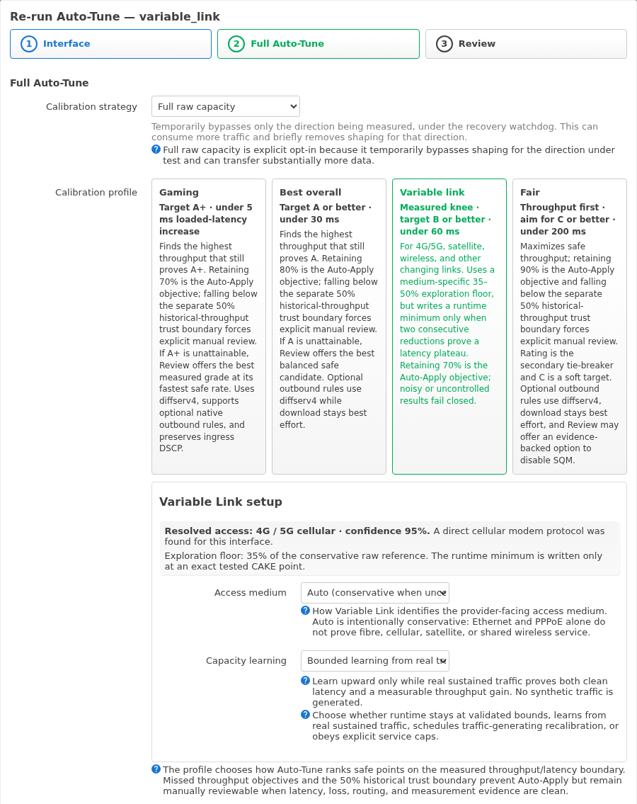
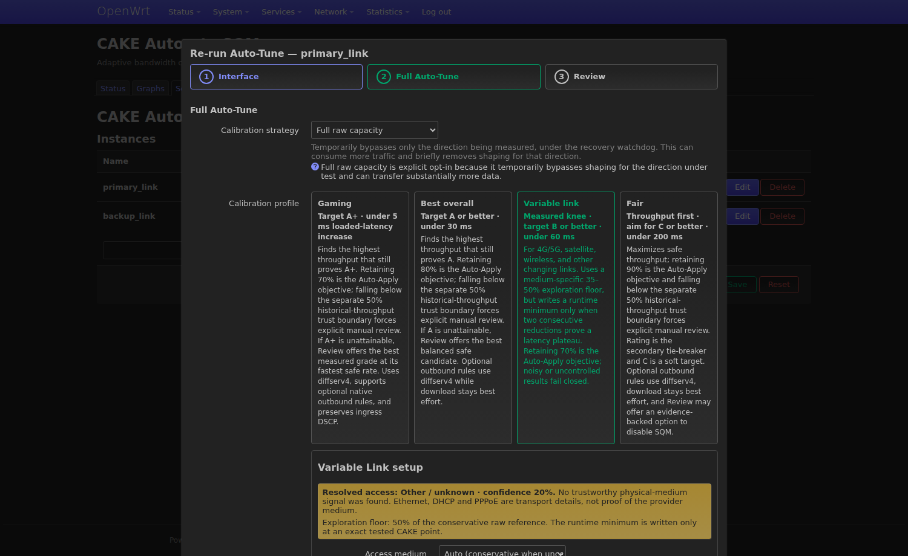
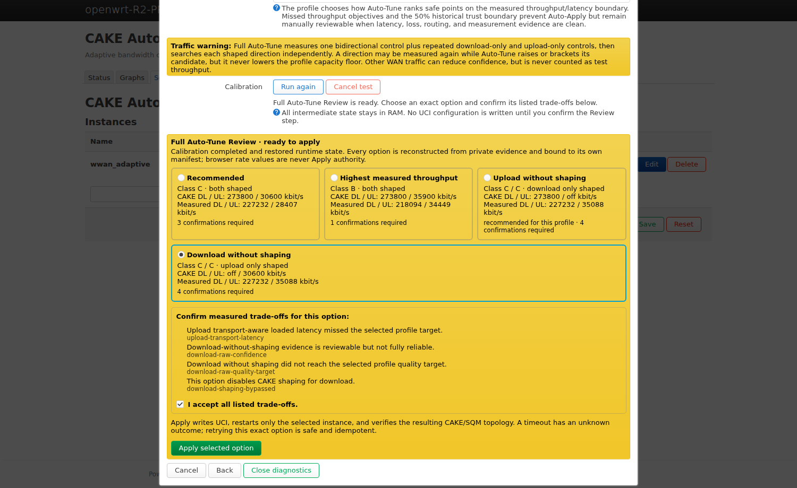
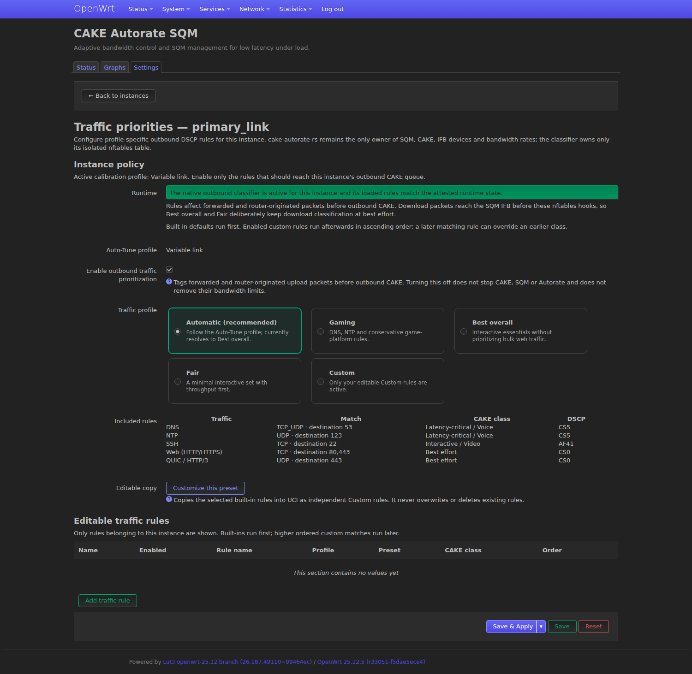

# User guide

This guide walks through the Full LuCI interface screen by screen. The
headings are stable link targets for the **Learn more** links in the UI.
Lite provides the controller, routing and SQM screens only; it has no
Rating, Speed Test, Auto-Tune or Graphs.

For a first installation follow the [quick setup guide](SETUP_GUIDE.md).

## Status

**Status** keeps the operational state in one place: uplink lifecycle,
Autorate/SQM/classifier health, active profiles, current collection state and
the last complete connection rating. The anonymized current-version example
below shows a cellular uplink with upload-only shaping and the honest
**WAITING FOR DATA** state. After a
complete passive or guided capture, **LAST KNOWN** preserves that DL/UL grade;
an incomplete or contaminated attempt never replaces it.

### Display preferences and service actions

**List columns** saves display choices
in `/etc/config/cake-autorate-ui`, separately from controller rates and SQM.
Changing columns does not apply pending rate changes or restart a service.
Until the first explicit save, the existing column preference is still read;
**Reset default** records an explicit default selection. The UI preferences
remain part of the existing Full LuCI package and its configuration backup.

Start, Stop and Restart report the command result and refresh Status after
success. If the status refresh itself fails, that is reported separately from
the completed service action. Diagnostic exports omit malformed or truncated
structured sources with a reason instead of emitting unparsed configuration.
Full and Lite treat dynamic errors and status/configuration metadata as literal
text, including route labels and instance names. Markup in a diagnostic cannot
create elements in the notification.

Diagnostic downloads use an authenticated streaming path. The browser
validates a complete, versioned JSON envelope and downloads the same plain text;
the decoded bundle remains bounded to 8 MiB. The command-line
`cake-autorated --log-bundle all` keeps its plain-text format; add `--json`
before the section argument for the validated transport format. Upgrade the
daemon and Full UI together; the UI package requires a daemon of the same release.
Completed Rating/Speed Test/Auto-Tune JSON results also use the streaming path,
while Start, Cancel and Apply keep their existing RPC receipt behavior.
An accepted Apply whose reply is lost is retried with the same option, digests
and acknowledgements. Do not start a different operation merely because a
request timed out; inspect its authoritative state first. Lite **Reset** also
discards this page's staged autorate/SQM changes, not just the visible form.

## Get rating

**Get rating** offers an automatic router-side test and a guided client
capture. The dialog first attests the current operation for that exact
instance; a second tab reconnects to an active Rating instead of starting a
competing job. Starting Guided after a completed Automatic run creates a new
job and worker identity, while closing during an in-flight Start receipt still
cancels the exact admitted job. Raw lease/debug identities are never shown to
the user.

## Graphs

**Graphs** use an opt-in, bounded RAM-only history. Latency, transport delta,
effective delay, CPU and synchronized download/upload traffic share the same
timeline; the oldest samples are discarded automatically and nothing is
written to flash. New traffic rows show interval means and separate sampled
peaks; hover text reports the actual observation duration. Older rows remain
identified as instantaneous samples. RTT and CPU remain snapshots. The live
Multi-WAN capture also shows an adaptive backoff
event on the shared time axis.

## Settings and instances

**Settings** manages each uplink independently and exposes traffic priorities,
Full Auto-Tune, categorized editing and deletion directly from its instance
row. A clean package installation creates no instance until the user chooses
**Create instance**.

The Edit dialog groups routing, rate limits, adaptive ceiling, probes, quality,
controller, SQM, testing and monitoring controls instead of presenting one long
form. See the current [categorized Autorate setup](docs/screenshots/settings-autorate-setup.png).

## Full Auto-Tune

**Full Auto-Tune** offers Gaming, Best overall, Variable link and Fair
calibration profiles,
then measures the selected uplink and presents diagnostics before anything is
written to UCI. Multi-WAN calibration keeps the route and evidence separate for
each selected uplink. Gaming additionally has a one-run **Extreme A+ search**
for wide links: it accepts only measured A+ minima, disables Auto-Apply below
70% retained capacity, and warns that such a throughput sacrifice is intended
for short latency-critical sessions rather than continuous household use.

Variable link opens a small access/capacity wizard instead of guessing the
provider medium from an Ethernet or PPPoE handoff. QMI/MBIM/NCM and modem-like
devices can be identified with an explicit confidence value; cellular,
LEO/GEO satellite, fixed wireless/WISP, shared wired and unknown access can
always be selected manually. The choice sets only the bounded exploration
floor and probe cadence. It never invents a runtime limit: only an exact tested
CAKE point may become the minimum or safe ceiling. Runtime learning is a
separate choice between **Validated ceiling only**, **Bounded learning from
real traffic**, **Bounded + scheduled active calibration**, and **Explicit
service hard caps**.

During a run, the dialog reports an evidence-backed percentage and the current
operation, such as idle-latency measurement, raw capacity, download/upload
search, candidate confirmation, directional comparison, restoration, or
proposal preparation. Progress is monotonic but is never advanced by an
elapsed-time animation; 100% is reserved for a published Review after the
previous runtime has been restored.

Review can present several independently measured choices. Every trade-off for
the selected card is listed, followed by one aggregate **I accept all listed
trade-offs** confirmation. For explicitly selected cellular, satellite, and
fixed-wireless access, Full raw capacity also attempts a download-unshaped /
upload-shaped result. If that control cannot satisfy the hard evidence gates,
the card remains visible but disabled with its exact reason.

### Controlled cellular observations (anonymized)

The following controlled OpenWrt cellular-link sample runs are anonymized benchmark evidence and are **not** shipped behavior or guarantees.

- Raw/unshaped path: **324–342 / 40–43 Mbps** observed with **C/C**.
- Existing CAKE 114.5/15.8 produced **102–104 / 14.2** with DL **C** and UL **A**.
- Upload-only shaping showed about **342 / 13.9** with DL **B** and UL **A**.
- Simultaneous load comparison:
  - no CAKE: **202 / 44.9**, D, **205 ms**
  - 114.5/15.8: **107 / 11.7**, A, **17 ms**
  - 250/15.8: **219 / 10.3**, B, **34.8 ms**
  - 200/15.8: **180 / 11.7**, B, **31.6 ms**
  - 175/15.8: **154 / 11.2**, A, **18.8 ms**

ICMP samples in this set stayed around **10–13 ms** while TCP/WebSocket samples were **72–190 ms**. This is a measurable risk signal that some providers/networks may prioritize or specially treat ICMP, so ICMP-only grading can understate user-traffic latency.

## Transport-aware adaptive capacity

RC27 implements the following controller and LuCI model:

- Keep raw capacity, current rate, measured runtime minimum, exploration
  minimum, safe ceiling, failed bound, confidence and route epoch independently
  for download and upload. A route/source/member change expires old evidence.
- Offer an explicit raw-capacity calibration mode which transactionally removes
  only the managed download ingress CAKE/IFB path, measures the selected uplink,
  and restores the exact prior runtime through a watchdog even if the worker or
  browser disappears. Upload shaping may remain active when the selected test
  requires it.
- Run shaped candidates through the same transport-aware path, then confirm the
  selected DL/UL pair under simultaneous load. The worse corroborated ICMP or
  native transport delta is authoritative.
- Build one ranked Review set from as many as four independently measured
  runtime topologies: both directions shaped, upload-only shaping,
  download-only shaping, and no SQM. Every card names its exact tested rates
  and evidence; Auto-Tune never derives or invents an untested rate merely to
  make a proposal available.
- Keep profile class, retained-capacity objectives, and relative utility versus
  another safe topology as policy judgements rather than technical failures.
  A proposal that misses one of them remains selectable only after Review shows
  the deviation and the user explicitly acknowledges that proposal's warning.
- Keep measurement integrity, route identity, raw-bypass proof, complete
  background accounting and contamination limits, loss, the manual-review
  latency ceiling, and a proven 50–110% CAKE realization safety envelope for
  every shaped direction as non-overridable hard gates. Historical-throughput
  trust and the ordinary 80% realization objective remain explicit Review
  warnings inside that envelope. Acknowledging a profile trade-off cannot
  weaken the hard checks.
- If shaped frontier search cannot produce a safe result but the independent
  raw control is complete and passes every applicable hard gate, carry an exact
  no-SQM fallback into Review instead of discarding the whole run. This is a
  manual proposal backed by the measured raw topology, not permission to infer
  missing shaped evidence.
- The same running SQM topologies can be selected manually in **Edit → SQM
  setup → CAKE directions**. One-sided mode removes CAKE from the unselected
  direction; it is not the same as retaining CAKE at a fixed rate by disabling
  Adjust DL or Adjust UL. Logical capacity values remain independent of the
  managed SQM runtime `0` marker used for an absent direction, including across
  the standard LuCI Save & Apply cycle.
- Treat a flat latency curve as directional evidence. If one Variable-link
  direction meets its quality target but lower tested CAKE rates provide no
  repeatable latency improvement, hold that direction at its highest safe,
  target-meeting tested point while the peer direction finishes its search.
  Such a result is always manual-review only, requires a safe simultaneous
  DL+UL confirmation, and never invents an untested runtime minimum.
- When Variable-link reaches its medium-specific 35%, 40%, or 50%
  exploration boundary without proving a knee, or bounded repeats remain
  nonmonotonic, keep the result useful without
  overstating it: select the best exact-tested safe point at or above the 50%
  trust boundary, use that same point as the runtime minimum, require a safe
  simultaneous DL+UL confirmation, and expose it only for manual review.
- Each close manual proposal lists every missed advisory/profile criterion in
  Review. One aggregate checkbox accepts the complete displayed set for that
  exact topology; the individual codes remain bound to Apply and cannot be
  hidden or changed after confirmation. A final simultaneous latency miss is
  reviewable only within the adjacent quality class: Gaming/Extreme A+ to A
  (30 ms), Best overall A to B (60 ms), Variable link B to C (200 ms), and Fair
  C to D (400 ms). Final simultaneous realization between 50% and the ordinary
  80% proof threshold is also an explicit per-direction acknowledgement.
- Grow passively only under proven saturation, clean transport evidence and a
  measurable throughput gain. The selected policy may instead freeze the
  exact validated ceiling, add budgeted scheduled calibration, or enforce
  explicit service caps. Variable Link never treats either policy choice as
  evidence of capacity above its measured raw control.
- Apply causal backoff: two reductions without meaningful latency improvement
  restore the last useful point and enter `HOLD_NO_EFFECT` instead of destroying
  throughput for radio/operator delay outside CAKE's control.
- Keep three user choices separate: calibration strategy (**Shaped only**,
  **Full raw capacity**, or **Reuse trusted bounds**), runtime learning
  (**Validated ceiling only**, **Bounded learning from real traffic**,
  **Bounded + scheduled active calibration**, or **Explicit service hard
  caps**), and
  operating profile (Gaming, Best overall, Variable link, or Fair). Reuse is
  enabled only after that instance has saved positive DL and UL P50 references;
  an uncalibrated or stale reuse choice is explained and safely normalized to
  Shaped only.
- Keep scheduled traffic injection opt-in. The scheduler reserves and settles
  per-instance daily/monthly byte allowances in a crash-safe ledger, shows the
  next due run and remaining allowance, and enforces its admission and stopping
  policy. A byte allowance is not a guarantee of exact physical-WAN usage.
- Full raw capacity first measures comparable bidirectional, download-only and
  upload-only controls by bypassing only the direction under test. For
  explicitly selected cellular, satellite, and fixed-wireless access it then
  additionally attempts a terminal upload-only-shaped experiment with download
  ingress bypassed. A verified result becomes a separate manual option;
  unavailable or unsafe evidence remains an explained disabled card, never a
  silent runtime topology change.
- Keep fail-closed behavior unchanged: an integrity, identity, contamination,
  or restoration failure preserves the last safe state and publishes either a
  typed diagnostic or an exact evidence-backed manual option; it never invents
  a lower-confidence rate.
- Bind every manually reviewable deviation to the exact option as a stable
  acknowledgement code. Auto-Apply is possible only when that option requires
  no acknowledgements; there is no global confidence label which can weaken a
  hard gate.

One historical high-capacity cellular development run requested a 2 GiB traffic
limit. It completed raw measurements near **403/46 Mbps** and a first shaped
point near **220/30 Mbps**, then stopped with typed
`traffic-budget-exhausted`, restored the original SQM runtime and wrote no UCI.
A complete Variable-link frontier at that capacity can consume roughly
**4.5–6 GiB**, so periodic active testing must be enabled only with an
appropriate data allowance. CPU saturation is reported as advisory evidence;
it does not by itself reject an otherwise safe candidate.

## Test traffic budget and server qualification

Initial Full Auto-Tune and manual reruns require a traffic-policy choice:
Unlimited, a preset of 1/5/10/25/50/100 GB, or a custom total. These are decimal
GB and apply to **download plus upload for the whole test**, not separately to
each direction or attempt. There is no implicit 32 GB default. Remembering a
choice is explicit and scoped to one instance in the current browser. A retry
of the same admitted request retains its original policy and debit history.
Scheduled daily/monthly reservations remain independent; manual Unlimited does
not remove scheduler limits. Lite does not provide active Auto-Tune.

The service refuses a capped test below its known mandatory evidence minimum
before starting traffic. Capped raw testing also requires declared DL and UL
service ceilings for stopping headroom; a planning estimate or a slow server
measurement cannot supply that authority. Do not invent service ceilings to
pass admission. Stopping headroom is included in the chosen allowance. Passing
the minimum does not guarantee completion: optional checks, retries and changing
conditions can exhaust the remaining allowance. The displayed full-plan scenario
is an estimate, not a physical minimum, guaranteed maximum, or limit on measured speed.
New interactive capped launches also reject allowances below the initial-stage
planning estimate when both expected rates are known: 15 seconds per direction
for two independent servers with three repeats, then two controls per direction.
Planning rates are separate from service ceilings and never alter shaper rates.
CLI callers can supply the pair `--planning-dl-kbps` and `--planning-ul-kbps`
(integer 1..100000000 kbit/s). Without that pair, a new explicit capped CLI
launch uses available configured/service rate hints, as the UI does; those hints
are assumptions, not measurements. Choose a larger allowance or Unlimited if
the initial-stage estimate does not fit. Completion can still need more traffic.
The planning pair is bound to the request, retained on retry, and exposed in
status as `traffic_planning`. Old requests and scheduler policies retain their
original semantics. The UI checks `native_traffic_planning_version=1` before
sending the new fields; it does not silently drop them for an older daemon.
Unlimited removes byte admission/stop limits, not cancellation, deadlines,
accounting, route checks or runtime restoration.

A standalone Full Speed Test asks for the same choice before it starts when the
daemon reports `native_speedtest_traffic_policy_version=1` (CLI:
`--traffic-policy unlimited|capped`, `--traffic-budget-bytes N`). The total
covers download plus upload, retries included, and contains the stopping
reserve. A direction still shaped by managed CAKE uses its highest configured
ceiling (adaptive ceiling included) for that reserve. The default unshaped test
bypasses the shaper in the measured direction, so a capped choice needs its
actual service ceiling (`--service-dl-cap-kbps`, `--service-ul-cap-kbps`);
without it, or when the total cannot hold the reserve plus route proof, the
test is refused before traffic. These ceilings never change shaping or results.
Callers that send no policy keep the historical derived budget.

New traffic accounting uses test-owned IP counters for backend traffic and
probes, including discovery, rejected attempts, retries and gaps between loads.
Background user traffic remains a separate measurement-quality concern. System
DNS and local DNS filtering are retained; attribution through a shared resolver
is approximate. After test producers stop, a private-rule cutoff freezes the
recorded interval before the counters are removed. Later packets are excluded.
Consequently this is **not exact physical-wire billing or a strict ingress-byte
guarantee**. Polling and stop latency can produce an observed overrun; the UI
reports it rather than rounding usage down to the allowance.

During a run, displayed consumption is the last saved debit, not a live total.
The final total includes the verified tail through the cutoff. An interrupted
write is reconciled against the bound intent, journal and cutoff; it is never
blindly appended again. Missing or inconsistent evidence yields unknown usage,
not zero, and cannot release a scheduler reservation as an exact settlement.
Zero before admission requires a separate bound no-producers receipt. Legacy
records retain their original accounting interpretation and are labelled as such.

Server qualification first compares repeated DL/UL observations from three
servers. If that group is insufficient, it can examine three backup servers;
backups are skipped when the first group qualifies. It requires stable,
competitive independent reported sources. A chosen
server must pass the comparison too; it is not silently replaced. Qualification
does not prove that all equally slow servers represent the link's true capacity.
During the single-direction raw controls the other direction keeps a CAKE
shaper, and its ACK/request traffic crosses it. That temporary shaper now runs
at least at this run's qualified median for that direction (bounded by the
declared service cap), not at a stale low configured rate that would throttle
the measured direction and make it incomparable with the unshaped
qualification. It is never lowered below the current rate and never becomes a
proposal or cap.
The UI separates observed throughput from proposed CAKE rates. A fall below 50%
of a retained, verified comparable same-boot raw reference blocks a new Apply;
this guard does not invent a historical reference after reboot. Reviewing or
rejecting a proposal does not apply its rates.

### Retries after a server failure

Public speed-test servers occasionally refuse a connection or stop mid-test.
**Retries after a server failure** (0–5, default 2) sets how many times one
measurement is repeated after such a failure, with a short pause, before that
measurement is marked unavailable. Failed attempts do not count as
measurements, and their traffic is still counted in the test budget. Route,
traffic-accounting and deadline failures still stop the test immediately.
Scheduled runs use the default.

## Explicit policy route

`route_mode=explicit` (Full package only) pins probes, Speed Test and Full
Auto-Tune to an existing policy route: a source IPv4 address, a routing
table and a firewall mark with its mask. Speed Test and Auto-Tune also need
**Route DNS IPv4** so that name resolution uses the same route. The mode never
creates VPNs, ip rules or tables. If the route stops matching, probes and
tests stop instead of falling back to the main table. Details and the
split-default/VPN behaviour are in
[Multi-WAN routing](MULTIWAN.md#explicit-policy-route-route_modeexplicit-full-only).

## Traffic priorities

Traffic policy is one exclusive per-instance choice:
**Automatic**, **Gaming**, **Best overall**, **Fair**, or **Custom**. Automatic
follows the Auto-Tune profile; pinned policies do not change on later
calibration. Previewed rules come from the same catalog as the nftables
renderer, **Customize this preset** stages an editable UCI copy without
auto-commit, and the independent classifier master remains off unless the user
enables it. Status names both the Auto-Tune and traffic-priority profiles.

The legacy migration is one-time and idempotent. It adds a resolved profile and
migration marker but never enables traffic rules, Autorate, or SQM. Desktop,
touch, keyboard, and narrow mobile layouts are covered by deterministic tests
and authenticated Playwright checks.

[Mobile preset view](docs/screenshots/traffic-priorities-mobile.png) ·
[staged Custom copy](docs/screenshots/traffic-priorities-custom.png)

The screenshots use anonymized instance, interface, host and address labels.
They combine a completed rating capture with the current RC27 Multi-WAN,
graphs, Auto-Tune and traffic-priority interface; rates and diagnostics are
representative examples rather than guarantees.

See [Profile traffic priorities](TRAFFIC_PRIORITIES.md) for the rule model.

## Optional external IPv4 lookup

External-address lookup is disabled by default in Full and Lite. Existing
instances with no `external_ip_check_enabled` option also make no lookup.
Enable it explicitly in Full's Advanced options or Lite's Connection tab only
if you want this additional route metadata. The HTTPS service sees your public
address and request times. This setting does not disable other independently
configured latency probes, reflector-list downloads, or user-requested tests.

Per-instance options:

- `external_ip_check_enabled`: `0` by default, `1` to enable.
- `external_ip_check_url`: defaults to `https://api.ipify.org`; use an HTTPS
  host/path returning one plain IPv4 address, without credentials, query or
  fragment. URLs are limited to 1024 ASCII bytes.
- `external_ip_check_interval_s`: defaults to 3600 seconds; range 60–604800.

When enabled, a lookup starts only on an admitted route, with at most one
request in flight. Failures and route changes do not bypass the interval in
the running daemon. A daemon restart starts a new interval schedule. Each
fetch has a five-second total execution deadline and a 1024-byte output bound;
surrounding route inspection uses the existing route helpers. Failed or stale
results do not prevent ordinary rate control, and external address metadata
does not replace the device/source/mark/table route identity. No external IP
lookup is needed to run the controller.
